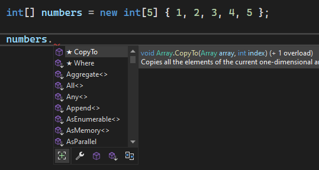

# Kolekcje i wywołania LINQ

Witak w kolejnym module! Tym razem zajmiemy się kolekcjami w języku C# oraz operatorami LINQ. W poprzednich modułach miałeś już okazję korzystać z tablic (`new T[]`) oraz list (`new List<T>()`). Tym razem zajmiemy się tematem trochę głębiej poznając temat od strony teoretycznej jak i praktycznej. Na koniec tego modułu chciałbym żebyś umiał efektywnie przechowywać i zarządzać zbiorami obiektów oraz wiedział w jaki sposób dobierać typ kolekcji do wymagań oraz czym się charakteryzuje i jakie ma wady oraz zalety każda z nich.

Poznasz również LINQ (Language-Integrated Query), który ułatwia obsługę kolekcji poprzez możliwości sortowania, filtrowania w sposób prosty i szybki bez używania pętli - przy czym szybkość będzie tutaj miała pojęcie względne o czym przekonasz się w dalszej części.

## 1. Co to są kolekcje i dlaczego są ważne?

Platforma .NET zapewnia standardowy zestaw typów kolekcji, które pozwalają na obsługę dowolnych zbiorów danych. Wśród nich możemy znaleźć listy o zmiennym rozmiarze (np. listy), listy o stałym rozmiarze, słowniki, czy tablice. Typów jest cała masa i tylko od naszych wymagań zależy, który z nich powinien zostać użyty.

Ważne żebyś zapamiętał, że spośród wszystkich kolekcji tylko tablice są wbudowane w język C#. Reszta typów kolekcji to wbudowane klasy, które w jakiś sposób rozszerzają tablice dodając im dodatkowych funkcjonalności.

Typy kolekcji możemy podzielić na następujące kategorie:

- Interfejsy definiujące standardowe protokoły kolekcji np. `IReadOnlyList<T>`;
- Gotowe do użycia klasy kolekcji np. `List<T>`, `Dictionary<TKey, TValue>`;
- Klasy bazowe do pisania kolekcji specjalnie dostosowywanych do potrzeb konkretnych aplikacji np. `CollectionBase`.

**Uwaga:** Zauważ, że większość kolekcji przedstawiana jest jako typy generyczne, wynika to z tego, że chcemy żeby mogły pracować z dowolnymi typami podanymi przez programistę.

Głównym czynnikiem przemawiającym za wykorzystywaniem kolekcji jest ich skuteczność i wydajność. Zostały przez twórców zaprojektowane tak, aby były wydajne i efektywne. Pozwalają na przechowywanie i zarządzanie dużymi zbiorami danych. Dodatkowo dostarczają szereg metod, który pokrywają większość zapotrzebowania użytkownika (dodawanie, usuwanie itd.). Kolejnym ważnym czynnikiem jest bezpieczeństwo typów, które jak już pewnie zdążyłeś się przekonać jest podstawowym wymaganiem języka C#. Dzięki temu masz pewność, że obiekty przechowywane w kolekcji będą zgodne w zakresie typu.

## 2. Typy kolekcji, czyli co, jak, kiedy?

W tym podrozdziale zajmiemy się najpopularniejszymi kolekcjami występującymi w języku C#. Omówimy sobie ich definicję, przeanalizujemy najpopularniejsze metody oraz zastanowimy się jakie są ich zastosowania na podstawie rzeczywistych przykładów.

### 2.1 Tablice - `Array<T>`

Klasa `Array<T>` to podstawa wszystkich jedn- i wielowymiarowych tablić oraz jeden z podstawowych typów implementujących standardowe interfejsy kolekcji. Ponieważ tablica jest generyczna, dzięki temu wszystkie tablice dysponują takim samym zestawem metod niezależnie od ich deklaracji i typu elementów.

Mogłeś też zauważyć, że tablice deklarujemy inaczej niż standardowe klasy - `int[] tab = new int[]`. Zostało to zrobione ze względu na wielkie znaczenie tablic w języku C# i z tego powodu utworzona specjalną składnię do ich deklarowania i inicjalizowania.

Cechą charakterystyczną tablic jest ich niezmienny rozmiar. Zauważ, że tworząc tablicę zawsze musisz przekazać jej rozmiar. Dzięki takiemu założeniu system CLR przypisze utworzonej tablicy ciągły obszar w pamięci. Dzięki temu indeksowanie jest bardzo szybkie, ale za cenę braku możliwości rozszerzenia rozmiaru w późniejszym czasie.

Tablice mogą przechowywać dowolny typy, czy to wartościowy czy referencyjny. W przypadku typów wartościowych są one przechowywane bezpośrednio w tablicy, dla przykładu weźmy tablicę 5 liczb całkowitych (każda zajmuje 8 bajtów), więc system CLR zarezerwuje ciągły obszar pamięci o wielkości 40 bajtów. W przypadku typów referencyjnych (które ważą 4 bajty w środowisku 32-bitowym i 8 bajtów w 64-bitowym) system CLR dla tablicy o rozmiarze 3 zarezerwuje 24 bajty (12 w środowisku 32-bitowym).

**Uwaga:** pamiętaj, że tablice są typami referencyjnymi, niezależnie od rodzaju przechowywanych w niej elementów i podlegają wszystkim zasadom typów referencyjnych, dlatego też wynikiem działania kodu `array2 = array1` będą dwie zmienne odnoszące się do tej samej tablicy. Przy czym porównanie dwóch tablic zawsze da wynik negatywny (chyba, że programista użyje własnego komparatora).

W obecnej wersji .NET istnieje już wbudowany komparator, który pozwala na porównanie dwóch tablic na podstawie ich zawartości. Zostało to przedstawione na poniższym przykładzie:

```csharp
int[] array1 = new int[] { 1, 2, 3 };

int[] array2 = new int[] { 1, 2, 3 };

bool operatorEqual = array1 == array2;

bool linqEqual = array1.SequenceEqual(array2);

IStructuralEquatable se = array1;
bool structuralEqual = se.Equals(array2, StructuralComparisons.StructuralEqualityComparer);

Console.WriteLine(operatorEqual); // False
Console.WriteLine(linqEqual); // True
Console.WriteLine(structuralEqual); // True
```

Należy uważać, ponieważ przy porównaniu kolejność ma znaczenie, w przypadku tablicy `int[] array2 = new int[] { 3, 2, 1 }` wszystkie porównania zwróciłyby wartość `False`.

Gdyby ktoś Cię kiedyś spytał czy można zmienić rozmiar tablicy to odpowiedź brzmi - tak. Można w tym celu wywołać metodę `Resize`, przy czym jej działanie polega na utworzeniu nowej większej tablicy i skopiowaniu do niej wszystkich elementów. Nie dość, że operacja jest nieefektywna to dodatkowo wszystkie referencje nadal będą wskazywać na starą strukturę. W takim przypadku zalecane jest użycie listy.

Możemy się przyjrzeć bliżej inicjalizacji tablic. Najlepszą praktyką jest tworzenie tablicy przy pomocy konstruktora `new T[]`:

```csharp
int[] numbers = new int[5]; // tworzy tablicę 5 elementów, z których każdy element ma wartość 0
numbers[1] = 10; // tablica ma postać - 0 10 0 0 0
```

Tablice możemy również inicjalizować wartościami bezpośrednio w konstruktorze, dzięki temu możemy również prznieść dedukcję rozmiaru tablicy na kompilator:

```csharp
int[] numbers = new int[3] { 1, 2, 3 };

int[] numbers2 = new int[] { 1, 2, 3, 4 }; // kompilator wydedukuje rozmiar tablicy 4

int[] numbers3 = new int[3] { 1, 2 }; // błąd kompilacji - rozmiar nie zgadza się z zawartością
```

Tablice jako typ przeliczalny odpowiadają standardowym operacjom przeglądania przy pomocy pętli.

Kolejną zaletą tablic jest wsparcie dla kolekcji wielowymiarowej. Możemy utworzyć np. tablicę dwuwymiarową, która mogłaby odpowiadać dwywymiarowej planszy. Dla przykładu spróbujmy utworzyć planszę do gry w szachy i na polu 3D umieśćmy królową, która odpowiada literze Q.

```csharp
char[,] chessBoard = new char[8,8]; // pusta tablica dwuwymiarowa 8x8

chessBoard[2, 3] = 'Q'; // umieszczamy w 3 wierszu i 4 kolumnie znak 'Q'
```

Tak naprawdę ciężko wskazać wszystkie metody, które zostały zaimplementowane w standardzie i mogą być używane na tablicach. Wszystko zależy od zdefiniowanych wymagań i potrzeb w danej chwili. Najlepszym sposobem jest utworzenie sobie przykładowej tablicy i przejrzenie, które z nich są dostęne i jaką spełniają funkcję:



Podsumowując tablica jest jednym z podstawowych typów kolekcji w języku C#. Jej cechą charakterystyczną jest stały rozmiar, który w znacznym stopniu przyspiesza przeglądanie takiej tablicy. Dodatkową zaletą tablicy jest możliwość tworzenia tablic wielowymiarowych imitujących jakieś powierzchnie.

Do częstych zastosowań tablic po za standardowymi, gdzie chcemy przechowywać zbiór obiektów i mamy pewność, że w przyszłości ich liczba się nie zmieni są również dane wielowymiarowe, które mają stałą wielkość np. obrazy, dźwięki, filmy, wszelkiego rodzaju modele matematyczne. Kolejnym przykładem użycia tablic może być ich zastosowanie w przenoszeniu wiadomości, które są odczytywane jako tablice bajtów. Wiemy, że tak odczytana wiadomość z pewnością nie będzie modyfikowana, a jedynie odczytywana w celu dalszego procesowania.

## 2.2 Listy - `List<T>`

Po tablicach przyszedł czas na ich bardziej elastyczny odpowiednik. Generyczna klasa `List<T>` umożliwiają tworzenie tablic obiektów o dynamicznym rozmiarze i należą do najczęściej używanych klas kolekcji.

Zastanówmy się chwilę nad wewnętrzną implementacją klasy `List<T>`. Wewnętrznie klasa `List<T>` przechowuje tablicę elementów `T[]`, która najczęściej na początku ma rozmiar 4 (chyba, że programista zdecyduje inaczej). Następnie przy operacji dodawania `Add(T item)` kolejny element umieszczany jest w kolejnym wolnym indeksie tablicy. W przypadku gdy maksymalny rozmiar został osiągnięty wewnętrzna tablica zwiększa swój rozmiar (najczęściej dwukrotnie), a następnie poprzednia tablica kopiowana jest do nowoutworzonej i dodawany element umieszczany jest w pierwszym wolnym miejscu. Identyczna zasada działania jest dla operacji `Remove(T item)`. Jeśli wewnętrzna tablica jest zajęta w mniej niż połowie jest ona na identycznej zasadzie kopiowana do mniejszego egzemplarza.

Przyjrzyjmy się sposobom deklaracji listy. Są one dość podobne do tych użytych przy inicjalizacji tablic:

```csharp
List<int> numbers = new List<int>(); // Pusta lista
numbers.Add(10); // Zawartość listy - 10
numbers.Add(20); // Zawartość listy - 10 20

List<int> numbers2 = new List<int> { 10, 20 }; // Zawartość listy - 10 20

List<int> numbers3 = new List<int>(10); // Pusta lista z wewnętrzną tablicą o rozmiarze 10

int[] sourceArr = new int[] { 3, 2, 1 };
List<int> numbers4 = new List<int>(sourceArr); // Zawartość listy 3 2 1
numbers4.Add(5); // Zawartość listy 3 2 1 5
```

Każdy z konstruktorów ma swoje zastosowanie i dla przykładu domyślnego konstruktora możemy używać przy przeglądaniu innej kolekcji i dodawaniu niektórych jej elementów do nowej listy na potrzeby dalszego użycia, a konstruktora przyjmującego inną kolekcję jeśli np. chcemy stworzyć listę na podstawie tablicy żeby mieć dostęp do funkcjonalności listy.

Jako, że lista jest chyba najczęściej używaną kolekcją w języku C# (głównie wynika to z tego, że programista zawsze woli zostawić sobie furtkę w przypadku potencjalnej zmiany wymagań kiedy kolekcja musiałaby być nagle modyfikowana) i w związku z tym myślę, że warto żebyśmy sobie przejrzeli jej najpopularniejsze metody i omówili ich zasadę działania oraz, abyś miał świadomość niektórych konsekwencji ich używania.

### 2.2.3. Metody typu "Add"

Zasadę działania tych metod omówiliśmy sobie wyżej przy opisywaniu listy i zasady jej działania. Przy dodawaniu elementów wyróżniamy dwie główne metody:

- `void Add(T item)` - metoda odpowiada za dodawanie elementu na końcu listy
- `void AddRange(IEnumerable<T> collection)` - metoda pozwala na dodanie zbioru elementów na końcu listy

Klasa `IEnumerable<T>` może być dla Ciebie póki co nie zrozumiała, ale na razie się nią nie przejmujmy. W dalszej części modułu ją sobie omówimy. Na chwilę obecną najważniejsze żebyś zapamiętał, że każda klasa, która jest przeliczalna (możemy po niej iterować przy użyciu `foreach`) implementuje interfejs `IEnumerable<T>`. W związku z tym do metody `AddRange` można przekazać każdą kolekcję, która zadziała z `foreach`.

Zobaczmy zastosowanie tych metod na przykładach:

```csharp
List<string> words = new List<string>();

words.Add("one"); // one

string[] wordsArr = new string[] { "two", "three" }; // one two three
words.AddRange(wordsArr);

words.AddRange(new string[] { "four", "five" }); // one two three four five
```

Dodawanie elementów na końcu listy jest operacją szybką i efektywna, ponieważ zazwyczaj na końcu jest wolne miejsce w tablicy wewnętrznej, ewentualnie zostanie ona rozszerzona

### 2.2.4. Metody typu "Insert"

Lista posiada również możliwość wstawiania elementów w dowolnym miejscu. Do tego służą metody:

- `void Insert(int index, T item)` - wstawia element `item` w miejsce o numerze `index`
- `void InsertRange(int index, IEnumerable<T> collection)` - wstawia kolekcję w miejsce o numerze `index`

Najważniejsze żebyś zapamiętał, że operacja nie podmienia zawartości, a jedynie wstawia elementy pod podany indeks, a resztę elementów przesuwa w przód. Zobaczmy to na poniższych przykładach:

```csharp
List<string> words = new List<string> { "one", "two", "three" };

words.Insert(1, "next"); // one next two three

words.InsertRange(2, new string[] { "four", "five" }); // one next four five two three

words.Insert(10, "out"); // wyjątek ArgumentOutOfRangeException - indeks musi być w obrębie listy
```

Korzystanie z metody `Insert` wydaje się być bardzo wygodne i pozwala na większą elastyczność w operowaniu na kolekcji, ale musimy zawsze pamiętać o konsekwencjach użycia, którymi jest mniejsza wydajność tej operacji w stosunku do metody `Add`. Wewnętrzna implementacja metody `Insert` powoduje tak naprawdę przesuniecie (skopiowanie) wszystkich elementów od `index..end`, i wstawienie w miejsce pustego indeksu, który się zwolnił po przesuniecie nowego elementu `T item`. Z perspektywy działania programu i mocy komputerów ten czas może być pomijalny, ale wyobraźmy sobie, że chcemy wstawić element w indeks 1 do listy posiadającej 100000 elementów. Wtedy 99999 będzie musiało być przesunięte, czyli przepisane w nowe miejsce.

Oczwiście w żadnym wypadku nie chcę demoniozować tych metod, bo jeśli jako programiści w naszym projekcie mamy tylko takie problemy optymalizacyjne to znaczy, że jest dobrze ;).

### 2.2.5. Metody typu "Remove"

Metody usuwające elementy z listy działają na podobnej zasadzie jak metody typu "Insert". Przyjrzyjmy się niektórym z nich:

- `bool Remove(T item)` - metoda usuwa element z listy. Porównanie odbywa się na podstawie metody `T.Equals` i usuwany jest tylko pierwszy napotkany element. Metoda zwraca `true` jeśli operacja usuwania się powiodła
- `void RemoveAt(int index)` - usuwa element spod konkretnego indeksu
- `void RemoveRange(int index, int count)` - usuwa liczbę elementów `count` poczynając od indeksu `index`. Metoda rzuci wyjątek `ArgumentOutOfRangeException` jeśli `count` przekroczy liczbę elementów poczynając od numeru indeksu
- `int RemoveAll(Predicate<T> match)` - usuwa wszystkie elementy spełniające warunek będący wyrażeniem lambda `Predicate<T>`. Jako rezultat zwraca liczbę usuniętych elementów.

Zobaczmy sobie działanie tych metod na przykładach:

```csharp
List<string> words = new List<string> { "one", "two", "three", "four", "five", "six", "seven" };

words.Remove("two"); // True - one three four five six seven

words.Remove("THREE"); // False - string.Equals zwraca uwagę na wielkość liter - Zawartość listy się nie zmieni

words.RemoveAt(1); // one four five six seven

words.RemoveRange(1, 2); // one six seven

words.RemoveAll(x => x.StartsWith('s')); // Zwróci 2, a zawartość listy to: one
```

Z praktycznego punktu widzenia wszystkie metody tak jak w przypadku `Insert` powoduja przesunięcie tablicy. Ale tak jak mówiłem w większości przypadków narzut jest pomijalny, warto jedynie o tym pamiętać. Metodą, na którą najbardziej trzeba zwrócić uwagę jest `Remove(T item)`, która jest zależna od impelemntacji metody `T.Equals` i czasem może prowadzić do niespodziewanych rezultatów kiedy myślimy, że obiekt się usunie z listy, a tak się jednak nie stanie.

### 2.2.6. Inne metody

Listy mają wiele różnych innych metod, których nie będziemy omawiać w tym module, a które najlepiej poznać w boju podczas realizowania projektów i spełniania wymagań biznesowych. Z kilku cech charakterystycznych o których warto wspomnieć w kontekście list:

- `T this[] { get; set; }` - Do elementów listy możemy się odwoływać podając indeks elementu, który chcielibyśmy odczytać
- `List<T> GetRange(int index, int count)` - Wyciąga "podzbiór listy" jako odrębną listę
- `T[] ToArray()` - konwertuje listę na tablicę

```csharp
List<string> words = new List<string> { "one", "two", "three", "four", "five" };

words[2] = "three_new";

List<string> listSubset = words.GetRange(2, 3); // three_new four five

List<string> invalidList = words.GetRange(3, 3); // System.ArgumentException - elementy są po za zakresem listy
```

Podsumowując listy są najbardziej uniwersalną kolekcją wbudowaną w język C#. Spełniają większość wymagań jakie może stawiać przed nimi programista. W dalszej części dotyczącej LINQ zobaczysz w jaki sposób można się nimi bawić i jak przeróżne operacje można na nich wykonywać.

Pamiętaj jednak, że mimo iż listy w C# są powszechnie używane nie są wolne od wad, których mysimy mieć świadomość:

- Wysoka złożoność czasowa dla niektórych operacji jak omówione wyżej wstawianie/usuwanie ze środka listy. Jeśli usunięcie elementu spowoduje konieczność przesunięcia to operacja może być kosztowna czasowo
- Przeszukiwanie listy jest operacją o złożoności O(n) - czas wykonania rośnie liniowo np. dla 100 elementów potrzebujemy maksymalnie 100 jednostek czasu na znalezienie szukanego, a przy 200 jest to 200 elementów (oczywiście w najbardziej pesymistycznym przypadku)

## 2.3 Słownik - `Dictionary<TKey, TValue>`

Słownik jest kolekcją, w której każdy przechowywany element stanowi parę klucz-wartość. Tego typu struktur danych najczęściej używa się do przeszukiwania i sortowania. Cechą charakterystyczną, która może być jednocześnie wadą i zaletą w przypadku słowników jest unikalność ich kluczy.

Dzięki mechanizmowi indeksowania na podstawie klucza słowniki oferują bardzo szybki dostęp do wartość na podstawie klucze. Czas dostępu do elementu w słowniku jest zazwyczaj stały - złożoność obliczeniowa wynosi O(1) niezależnie od rozmiaru słownika.

Jak zauważyłeś słownik `Dictionary<TKey, TValue>` jest typem generycznym, w którym masz pełną dowolność co do używanych typów. Ważne jedynie, abyś pamiętał, że klucze przekazywane pod `TKey` muszą być unikalne. W dalszej części dowiesz się w jaki sposób odbywa się sprawdzanie unikalności klucza.

Na początku zapoznamy się ze sposobami deklaracji słownika oraz najcześciej używanymi metodami, które pozwalają na pracę z nim. Może żeby już nie pracować z typami prostymi zdefinujmy sobie prostą klasę pracownik - `Employee`:

```csharp
class Employee
{
    public string FirstName { get; set; }

    public string LastName { get; set; }
}
```

### 2.3.1 Definicja

Słowniki możemy tworzyć na różne sposoby. Wszystkoe zależy czy mamy już jakieś dane początkowe czy dopiero będziemy chcieli je dodawać. Zacznijmy na początek od pusteg słownika pracowników, do którego następnie dodamy nowozatrudnionego pracownika. Kluczem dla naszego słownika będzie `string` będący jednocześnie identyfikatorem pracownika:

```csharp
Dictionary<string, Employee> employees = new Dictionary<string, Employee>();

employees.Add("Emp01", new Employee { FirstName = "Jan", LastName = "Kowalski" });
```

W przypadku gdy mamy dane początkowe, słownik może zostać nimi zasilony podczas inicjalizacji. Odbywa się to w podobny sposób jak przedstawiony wcześniej przy omawianiu listy:

```csharp
Dictionary<string, Employee> executives = new Dictionary<string, Employee>
{
    { "Emp001", new Employee { FirstName = "Adam", LastName = "Nowak" } },
    { "Emp002", new Employee { FirstName = "Anna", LastName = "Marzec" } }
};
```

Słowniki posiadają jeszcze kilka innych metod tworzących jako konstruktory, ale nie będziemy ich tutaj omawiać. Możesz je przeanalizować na własną rękę i zobaczyć czy znajdujesz dla nich zastosowanie.

### 2.3.2 Odczyt

Jak już wcześniej wspomnieliśmy odczyt ze słowniku odbywa się w czasie stałym niezależnie od liczby jego elementów. Jest jeden z głównych powodów, dla których z nich korzystamy. Łatwo można sobie wyobrazić przypadki zastosowania. Rozpatrzmy sobie problem uprawnień dla grup użytkowników. Zdefiniujmy sobie więc pojęcie uprawnienia:

```csharp
enum AccessType
{
    View = 1,
    Create = 2,
    Update = 4,
    Delete = 8,
    Full = View | Create | Update | Delete;
}

class Permission
{
    public string Object { get; set; }

    public AccessType Access { get; set; }
}
```

Następnie zdefiniujmy sobie słownik uprawnień w zależności od grupy użytkowników. Dla uproszczenia przekazałem do słownika tylko jedno uprawnienie, ale możemy sobie wyobrazić, że mogłoby być ich dziesiątki dla każdego z typów użytkowników:

```csharp
Dictionary<string, Permission> permissions = new Dictionary<string, Permission>
{
    { "Reader", new Permission { Object = "Product", Access = AccessType.View } },
    { "StoreManager", new Permission { Object = "Product", Access = AccessType.View | AccessType.Create } },
    { "Administrator", new Permission { Object = "Product", Access = AccessType.Full } }
};
```

Wartości ze słownika możemy odczytywać na kilka sposobów i każda z nich ma swoje cechy charakteryztyczne, które pozwalają na obsługę np. braku klucza:

```csharp
Permission adminPermission = permissions["Administrator"]; // Najprostszy odczyt

Permission notFound = permissions["Contributor"]; // Wyjątek System.Collections.Generic.KeyNotFoundException

bool keyFound = permissions.TryGetValue("StoreManager", out Permission managerPermission); // True - wartość zostanie przypisana do managerPermission

bool hasReader = permissions.ContainsKey("Reader"); // True - sprawdzi jedynie czy klucz istnieje
```

Jeśli dalej nie czujesz zastosowania słowników to wyobraź sobie sytuacje, że dla każdej operacji, którą wykonuje użytkownik musisz sprawdzić czy posiada do niej uprawnienia. Musiałbyś przeszukiwać kolekcje tysiące razy i wraz z rozrastaniem się systemu i dodawaniem kolejnych obiektów i uprawnień ich sprawdzanie zajmowałoby coraz więcej czasu.

Każda z tych operacji odczytu ma jakieś swoje zastosowanie. Sam musisz zawsze oceniać czy klucz w słowniku istnieje, a jeśli nie to w jaki sposób program powinien się zachować (zgłosić błąd, rzucić wyjątek). Najezpieczniejszą spośród metod jest `TryGetValue`, ponieważ jest połączeniem `ContainsKey` i metody dostępowej indeksu `this[]`.

### 2.3.3. Dodawanie

Aby dodać element do słownika należy wywołać metodę `Add` lub użyć metody dostępowej indeksu. Obie z tych metod różnią się zachowanie. Wywołanie metody `Add` z tym samym kluczem powoduje wyjątek. W przypadku metody dostępowej indeksu dodajemy nowy element do słownika jeśli element o takim kluczu nie istnieje. W przypadku istnieniu już klucza dokonywana jest modyfikacja wartości. Dla naszych przykładów użyjemy zdefiniowanego wyżej słownika uprawnień:

```csharp
Permission orderModifyAccess = new Permission { Object = "Order", Access = AccessType.Create | AccessType.Update };

permissions.Add("Contributor", orderModifyAccess); // Dodanie kolejnego klucza do słownika

permissions.Add("Contributor", new Permission()); // System.ArgumentException - zduplikowany klucz

permissions["StoreManager"] = orderModifyAccess; // Element o kluczu StoreManager będzie odnosić się teraz do orderModifyAccess

permissions["Guest"] = new Permission(); // Do słownika zostanie dodany nowy element pod kluczem Guest
```

Tak jak w przypadku odczytu sposób dodawania zależy od wymagań biznesowych. Możemy natomiast wyróżnić sobie pewne wzorce, które pomogą Ci podjąć decyzję:

- Dodawanie tylko raz -> `ContainsKey` + `Add`
- Dodawanie/Nadpisanie -> `this [] { set; }`
- Tylko nadpisanie -> `ContainsKey` + `this [] { set; }`

### 2.3.4 Inne metody

Spośród innych metod, które mogą Ci się przydać podczas używania słowników są:

- `ICollection<TKey> Keys { get; }` - zwraca listę kluczy w postaci kolekcji
- `ICollection<TValues> Values { get; }` - zwraca listę wartości

Metody te czasem się przydają. Wyobraź sobie, że chciałbyś wyciągnąć wszystkie grupy, dla których zdefiniowane zostały uprawnienia. Zamiast iterować się po całym słowniku wystarczy, że wywołasz metodę:

```csharp
ICollection<string> keys =  permissions.Keys; // zwróci listę wszystkich kluczy
```

### **2.3.5.** Skąd słownik wie o duplikacie?

W rozdziale tym omówimy sobie skąd słownik wie, że podany klucz już istnieje w słowniku. Na samym wstępie chcę Ci zaznaczyć, że jest to wiedza z zakresu rozszerzonego i jeśli czegoś nie będziesz rozumieć to nie masz powodu do niepokoju. Chciałbym jedynie, abyś miał ogólne pojęcie jak słowniki działają pod spodem, szczególnie gdybyś kiedyś ich używał przekazując np. jako klucz obiekt klasy.

W poprzednim rozdziale dotyczącym typu `object` poznałeś metody, które dziedziczy każda tworzona klasa. Jednymi z nich są `Equals` oraz `GetHashCode` i właśnie na podstawie rezultatów z tych dwóch metod słownik podejmuje decyzję czy dany klucz został już zdefiniowany.

Zazwyczaj każda z klas posiada domyślną impelmentację operacji sprawdzania równości, która opiera się na **porównaniu referencji**.

Jak natomiast możesz się domyślić programiście nie zawsze zależy na domyślnym znaczeniu tych operacji. Możemy sobie np. wyobrazić sytuację, że chciałbyś dodawać do słownika wartości po kluczu, który jest typu `string`, ale chcesz, żeby wielkość liter nie miała znaczenia. Domyślnie to nie zadziała, ponieważ metoda `string.Equals` zwraca uwagę na wielkość liter.

Rozważmy sobie prosty przypadek, gdzie zdefiniujemy sobie słownik przyjmujący jako klucz klasę `Person` wraz z wartością ratingu, który posiada. Załóżmy też, że jeśli osoba posiada to samo imię i nazwisko to z perspektywy naszej aplikacji jest to dokładnie ta sama osoba:

```csharp
public class Person
{
    public string FirstName { get; set; }

    public string LastName { get; set; }
}
```

Przykładowy słownik mógłby wyglądać następująco:

```csharp
Dictionary<Person, int> persons = new Dictionary<Person, int>();

persons.Add(new Person { FirstName = "Jan", LastName = "Kowalski" }, 95); // OK
persons.Add(new Person { FirstName = "Jan", LastName = "Kowalski" }, 100); // OK
```

W powyższym listingu oba wpisy zostały dodane do słownika. Tak jak powiedzieliśmy sobie na samym początku rozdziału domyślna implementacja operacji sprawdzania równości porównuje referencje, które w naszym przypadku są różne - posiadamy dwa różne obiekty zapisane w dwóch różnych miejscach w pamięci.

Aby nasz program spełniał wymagania biznesowe musielibyśmy jawnie zaimplementować w klasie `Person` metody `Equals` oraz `GetHashCode`:

```csharp
public class Person
{
    public string FirstName { get; set; }

    public string LastName { get; set; }

    public override bool Equals(object? obj)
    {
        Person o = obj as Person;
        if (o != null)
        {
            return o.FirstName == FirstName && o.LastName == LastName;
        }

        return false;
    }

    public override int GetHashCode()
    {
        return $"{FirstName}_{LastName}".GetHashCode();
    }
}
```

Dla powyższej implementacji klasy `Person` dodanie dwóch wartości do słownika tak jak w poprzednim przykładzie zakończyłoby się wyjątkiem:

```csharp
Dictionary<Person, int> persons = new Dictionary<Person, int>();

persons.Add(new Person { FirstName = "Jan", LastName = "Kowalski" }, 95); // OK
persons.Add(new Person { FirstName = "Jan", LastName = "Kowalski" }, 100); // System.ArgumentException
```

Zastanawiasz się dlaczego tak się stało? Ponieważ dla tych samych przekazanych danych metody `Equals` i `GetHashCode` zwracają te same wartości, a więc słownik interpretuje to jako próba dodania tego samego klucza, mimo że referencje do obiektów są różne.

Na platformie .NET stworzono dodatkowy protokół "dołączany", dzięki któremu można korzystać ze słowników z typem kluczy, dla którego chcemy zmienić domyślną implementację porównania. W tym celu stworzono interfejs `IEqualityComparer<T>`, który jest odpowiedzialny za sprawdzanie równości i w swojej definicji posiada dwie wyżej omówione metody:

```csharp
public interface IEqualityComparer<in T>
{
    bool Equals(T? x, T? y);

    int GetHashCode([DisallowNull] T obj);
}
```

Implementując ten interfejs programista otwiera sobie ścieżkę do pisania wielu różnych implementacji komparatora dla tej samej klasy. Następnie możemy stworzyć słownik przekazując mu w konstruktorze komparator (implementację interfejsu `IEqualityComparer<T>`), który będzie obowiązywał przez cały jego cykl życia. Definicja konstruktora dla słownika `Dictionary<int, string>` to:


Zobaczmy działanie własnych komparatorów w praktyce. Weźmy znów na warsztat naszą klasę `Person` i wyobraźmy sobie, że chcielibyśmy mieć dwa słowniki osób, przy czym jeden przechowywałby tak jak w poprzednim przykładzie osoby i ich rating, a drugi "rodziny" wraz z liczbą członków. W związku z tym próba dodania kolejnego członka o tym samym nazwisku powinna zakończyć się błędem, ale jednocześnie powinniśmy móc w prosty sposób sprawdzić rodzina o takim nazwisku została już dodana. Przykładową implementacją przedstawiono poniżej:

```csharp
public class Person
{
    public string FirstName { get; set; }

    public string LastName { get; set; }
}

public class FullNameEqualityComparer : IEqualityComparer<Person>
{
    public bool Equals(Person? x, Person? y)
    {
        if (x == null || y == null)
            return false;

        return x.FirstName == y.FirstName && x.LastName == y.LastName;
    }

    public int GetHashCode(Person obj)
    {
        return $"{obj.FirstName}_{obj.LastName}".GetHashCode();
    }
}

public class FamilyEqualityComparer : IEqualityComparer<Person>
{
    public bool Equals(Person? x, Person? y)
    {
        if (x == null || y == null)
            return false;

        return x.LastName == y.LastName;
    }

    public int GetHashCode(Person obj)
    {
        return obj.LastName.GetHashCode();
    }
}
```

Jak widzisz zaimplementowaliśmy dwie różne implementacje interfejsu `IEqualityComparer<Person>`, z których jedna jest odpowiedzialna za porównywanie osób, natomiast druga sprawdza jedynie nazwiska dzięki czemu możemy identyfikować dwie osoby o tym samym nazwisku jako członków tej samej rodziny:

```csharp
Person member1 = new Person { FirstName = "Jan", LastName = "Nowak" };
Person member2 = new Person { FirstName = "Anna", LastName = "Nowak" };
Person member3 = new Person { FirstName = "Jan", LastName = "Nowak" };

Dictionary<Person, int> ratings = new Dictionary<Person, int>(new FullNameEqualityComparer());
ratings.Add(member1, 95);
ratings.Add(member2, 100);
ratings.Add(member3, 80); // Wyjątek - osoba o takich danych już istnieje

Dictionary<Person, int> families = new Dictionary<Person, int>(new FamilyEqualityComparer());
families.Add(member1, 1);
families.Add(member2, 1); // Wyjątek - nazwisko już istnieje

families[member2] += 1; // wartość dla klucza "Nowak" będzie wynosić 2
```

Mam nadzieję, że koncept z komparatorami i ich różnymi implementacjami jest dla Ciebie zrozumiały. Główną zaletą tego rozwiązania jest możliwość dostarczania różnych sposobów porównań dla słowników posiadających ten sam typ jako klucz.

## 2.4 Inne kolekcje

Platforma .NET zawiera bardzo dużo różnych wbudowanych kolekcji, które pozwalają na pokrycie przeróżnych scenariuszy bez potrzeby pisania własnej implementacji. W tym rozdziale przyjrzymy się najpopularniejszym z nich.

### 2.4.1 Kolejki - `Queue<T>`

Jak pewnie domyślasz się po nazwie klasa `Queue<T>` dostarcza nam implementację kolejki w stylu FIFO (first-in, first-out) co w wolnym tłumaczeniu znaczy, że pierwszy element, który dodamy do kolejki zostanie również jako pierwszy wyciągnięty w momencie czytania. Jak sama nazwa wskasuje struktura ta najczęście wykorzystywana jest do zapewnienia wymagań związanych z kolejkowaniem. Najczęściej używane metody, które udostępnia klasa `Queue<T>` zostały przedstawione poniżej:

- `Enqueue(T item)` - dodaje obiekt `T` do kolejki
- `T Dequeue()` - wyciąga z kolejki pierwszy dodany obiekt
- `T Peek()` - pozwala podejrzeć następny obiekt w kolejce do wyciągnięcia bez ściągania go z kolejki
- `bool TryDequeue(out T item)` - próbuje ściągnąć obiekt z kolejki, jeśli się uda zwraca `true` i wpisuje obiekt do zmiennej `item`, a przeciwnym wypadku zwraca `false`
- `bool TryPeek(out T item)` - zachowuje się analogicznie jak `TryDequeue` przy czym nie ściąga elementu z kolejki

Uwaga: Metoda `TryDequeue` jest w większości przypadku zalecana przy ściąganiu elementów z kolejki, ponieważ metoda `Dequeue` w przypadku pustej kolejki powoduje wyjątek (ten sam przypadek ma zastosowanie dla `TryPeek` i `Peek`)

Teraz przeanalizujmy sobie użycie tych metod na przykładzie. Wyobraź sobie, że jesteś odpowiedzialny za implementację systemu informatycznego w urzędzie skarbowym, który wyświetlałby na ekranie aktualnie obsługiwany identyfikator zgłoszenia. Kolejność obsługi zgłoszeń na dany dzień byłaby ustalana na podstawie potwierdzenia ich przez petenta przy wejściu do budynku.

```csharp
class TaxOffice
{
    public Queue<string> TicketsQueue { get; set; }

    public void Confirm(string ticketId)
    {
        TicketsQueue.Enqueue(ticketId);
    }

    public void ShowCurrent()
    {
        string currentTicket = TicketsQueue.Dequeue();

        Console.WriteLine(currentTicket);
    }
}
```

Zdefiniowaliśmy klasę `TaxOffice`, która odpowiada jednemu z urzędów skarbowych. Klasa posiada dwie metody, jedna do potwierdzania przybycia natomiast druga wyświetla aktualnie obsługiwany numer. Użycie klasy mogłoby wyglądać następująco:

```csharp
TaxOffice office = new TaxOffice();

office.Confirm("t1"); // Kolejka - t1
office.Confirm("t2"); // Kolejka - t1, t2

office.ShowCurrent(); // Wyświetli - t1; Kolejka - t2

office.Confirm("t3"); // Kolejka - t2, t3

office.ShowCurrent(); // Wyświetli - t2; t1 - t3
office.ShowCurrent(); // Wyświetli - t3; t1 - PUSTA
office.ShowCurrent(); // Wyjątek InvalidOperationException
```

Myślę, na podstawie powyższego przykładu widzisz w jaki sposób kolejne elementy są ściągane z kolejki i przetwarzane. Niestety nasz program nie jest wolny od błędów, ponieważ jak możesz zauważyć jego działanie zawsze zakończy się błędęm na koniec dnia kiedy już nie będzie więcej zgłoszeń - program zgłosi wyjątek, że próbujemy wyciągnąć element z pustej kolejki.

Zastanówmy się jak moglibyśmy zmienić implementację, aby pozbyć się błędu. Zamiast metody `Dequeue` moglibyśmy użyć przedstawionej wcześniej metody `TryDequeue` i wyświetlać numer zgłoszenia jeśli udało się je znaleźć, w przeciwnym wypadku wyświetlać "BRAK". Implementacja metody `ShowCurrent` zmieniłaby się następująco:

```csharp
public void ShowCurrent()
{
    bool isDequeued = TicketsQueue.TryDequeue(out string ticketId);
    if (isDequeued)
        Console.WriteLine(ticketId);
    else
        Console.WriteLien("BRAK");
}
```

Powyższy kod przedstawiający użycie przestanie zgłaszać wyjątek. Możnaby powiedzieć, że nasz system spełnia wszystkie wymagania postawione przez biznes. Urzędnicy jednak zauważyli, że tracą bardzo dużo czasu w ciągu dnia ze względu na opieszałość ludzi, którzy przez rozkojarzenie nie wiedzą, że ich numer akurat pojawił się na ekranie. W związku z tym biznes zgłosił wymaganie, że chciałby obok aktualnie obsługiwanego numeru, wyświetlać następny numer w kolejce jeśli takowy istnieje.

Implementacja wymagania mogłaby wyglądać następująco:

```csharp
...
public void ShowCurrent()
{
    bool isDequeued = TicketsQueue.TryDequeue(out string ticketId);
    if (isDequeued)
        Console.WriteLine(ticketId);
    else
        Console.WriteLien("BRAK");

    bool isNext = TicketsQueue.TryPeek(out string nextTicketId);
    if (isNext)
        Console.WriteLine("Następny: " + nextTicketId);
}
...
```

Od razu użyłem metody `TryPeek` żeby uniknąć zgłoszenia wyjątku w momencie kiedy nie będzie kolejnego numeru. Zobaczmy jak przedstawiałoby się użycie naszego systemu:

```csharp
TaxOffice office = new TaxOffice();

office.Confirm("t1"); // Kolejka - t1
office.Confirm("t2"); // Kolejka - t1, t2

office.ShowCurrent(); // Wyświetli - t1; Następny - t2; Kolejka - t2
...
```

Kolejki najczęściej używane są jak sama ich nazwa wskazuje przy kolejkowaniu operacji, które chcielibyśmy aby były przetwarzane w kolejności dodawania. Są one niezbędnym narzędzie w przypadku gdy chcemy coś przetwarzać w tle lub gdy czas wykonania jakiejś operacji jest wolniejszy niż czas pomiędzy kolejnymi zgłoszeniami, przychodzące zgłoszenia muszą być wtedy odkładane na później.

### 2.4.2 Stack - `Stack<T>`

### 2.4.3 HashSet - `HashSet<T>`
