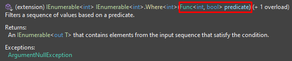

# Delegaty i Wyrażenia Lambda

W poprzednim rozdziale poznaliśmy typy generyczne, które odegrają niebagatelną rolę w rozdziale dotyczącym wyrażeń lambda i obsługi zdarzeń. Delegaty i wyrażenia lambda to jedne z najpotężniejszych i najważniejszych mechanizmów języka C#. Pozwalają one na tworzenie elastycznych i modułowych aplikacji poprzez umożliwienie przekazywania metod jako parametrów innych metod co umożliwia definiowanie zdarzeń oraz ich obsługi.

Do tej pory poznaliśmy różne mechanizmy pisania elastycznego kodu, którego implementacja zmieniała się w trakcie działania programu jak np. dziedziczenie i interfejsy. Wyrażenia lambda i delegaty są właśnie takimi mechanizmami, a tym co je wyróżnia w stosunku do powyższych jest prostota i dowolność stosowania.

W tym module dowiesz się co to są delegaty i wyrażenia lambda, jakie są między nimi różnice oraz jakie jest ich wykorzystanie w praktyce. Powiemy sobie w jaki sposób delegaty i wyrażenia lambda pomagają pisać bardziej efektywny i rozszerzalny kod.

## 1. Delegaty

Delegat jest type referencyjnym, który umożliwia przekazywanie funkcji jako parametru do innych metod lub klas. Delegat jest bardzo podobny do wskażnika na funkcję występujący w innych językach programowania przy czym spełnia podstawowe założenie języka C#, a mianowicie zachowuje bezpieczeństwo typów - czyli może przechowywać referencję do metody, która jest zgodna z jego sygnaturą (typem zwracanym i listą argumentów).

Najpierw przeanalizujmy definicję i użycie delegata na rzeczywistym przykładzie, a dopiero później przyjrzymy się teorii i definicjom. Załóżmy, że mamy klasę `Calculator`, która w swojej podstawowej wersji obsługuje 4 działania - "+", "-", "\*", "/". Gdybym Cię teraz poprosił o napisanie takiej klasy mogłaby ona wyglądać następująco:

```csharp
public class Calculator
{
    public double Add(double x, double y) => x + y;

    public double Subtract(double x, double y) => x - y;

    public double Multiply(double x, double y) => x * y;

    public double Divide(double x, double y) => x / y;
}
```

Przy czym każde kolejne rozszerzenia wymagałyby modyfikacji tej klasy i implementacji dodatkowych operacji. A co jeśli pojawiłaby się potrzeba zapisywania wyniku przed zwróceniem do listy operacji historycznych? Wtedy kod mógłby wyglądać następująco:

```csharp
public class Calculator
{
    private List<double> _historicalResults = new List<double>();

    public double Add(double x, double y)
    {
        double result = x + y;
        _historicalResults.Add(result);
        return result;
    }
    ...
}
```

Patrząc na powyższe metody możemy zauważyć pewien wzorzec, a mianowicie,że każda metoda ma bardzo podobną sygnaturę - `double nazwa_metody(double x, double y)`. A co gdybyśmy mogli zamknąć obsługę kalkulatora w pojedynczej metodzie i przenieść definicję operacji na użytkownika wywołującego metody naszego kalkulatora? W tym mogą nam pomóc deletagy, które pozwolą zdefiniować sygnaturę metody, która ma zostać przekazana z zewnątrz do naszego kalkulatora:

```csharp
public delegate double Operation (double x, double y);

public class Calculator
{
    private List<double> _historicalResults = new List<double>();

    public double Calculate(Operation operation, double x, double y)
    {
        double result = operation(x, y);
        _historicalResults.Add(result);
        return result;
    }
}
```

Użycie klasy `Calculator` wyglądałoby następująco:

```csharp
public static void Main()
{
    Calculator calculator = new Calculator();

    Operation add = Add;

    double result = calculator.Calculate(add, 10, 20);
}

public static double Add(double x, double y) => x + y;
```

Egzemplarz delegatu `add` pełni funkcję przedstawiciela, który wywołuje delegate, aby za jego pośrednictwem została wywołana metoda docelowa. Dzięki temu wyeliminowaliśmy zależność klasy `Calculator` od zmiennych założeń wywołującego.

Na podstawie powyższego przykładu możemy określić podstawowe założenie delegatów:

- usuwanie zależności z klasy i przenoszenie ich na wywołującego
- delegate są swego rodzaju wsakźnikami do funkcji (typami referencyjnymi) co pozwala nam na przekazywanie go w klasach, metodach i korzystać z niego w różnych miejsach kodu.
- delegaty umożliwiają odseparowanie logiki od interfejsu użytkownika co znacząco ułatwia rozszerzanie i testowanie kodu.

**Definicja:**

```csharp
delegate <typ_zwrotny> nazwa_delegatu (<parametry_wejściowe>);
```

## 2. Zaawansowane zagadnienia związane z delegatami

### 2.1. Pisanie metod wtyczek

Definicja delegatu jest typem referencyjnym co pozwala na wykorzystanie wszystkich zalet z tego wynikających. Metody do zmiennych delegacyjnych są przypisywane w czasie działania programu. Wykorzystując ten fakt możemy pisać metody wtyczki (tzw. plug-in methods), które będą mieć stałą logikę wewnętrzną, która będzie się zmieniać w zależności od metod przypisanych do delegatów.

Myślę, że najlepiej zrozumiesz to na rzeczywistym wymaganiu biznesowym, które sobie rozpatrzymy.

Wyobraź sobie, że tworzysz system do finalizacji zamówień w sklepie internetowym. Cześcią, którą się obecnie zajmujesz jest wyliczanie końcowej kwoty, którą użytkownik będzie musiał zapłacić za zamówienie. Na całą kwotę składają się następujące wartości:

- wartość koszyka
- cena wysyłki
- wykorzystanie kodu rabatowego

Dodatkowo chcielibyśmy umożliwić aby użytkownik mógł logować poszczególne wartości do dowolnie wybranego przez siebie miejsca w celu późniejszego sprawdzenia poprawności obliczeń

Jako producent oprogramowania chcesz dostarczać klientowi możliwie najbardziej rozszerzalny produkt, który będzie mógł sobie dostosowywać według potrzeb. Dla przykładu różni klienci mogą mieć różne kody rabatowe i ich wartości jak również kwota, od której dostawa będzie darmowa również moze być różna. Do zaprojektowania takiej funkcjonalności możemy wykorzystać delegaty:

```csharp
public delegate double ApplyPromo(double price, string discountCode);

public delegate double DeliveryFee(double price, string address);

public delegate void LogPriceCalculation(double shoppingCartValue, double discount, double deliveryFee, double endPrice);

public class OrderSummary
{
    private double _shoppingCartValue;
    private string _discountCode;
    private string _deliveryAddress;

    public double CalculateEndPrice(ApplyPromo discount, DeliveryFee deliveryFee, LogPriceCalculation logging)
    {
        double endPrice = _shoppingCartValue;

        double discountValue = discount(_shoppingCartValue, _discountCode);

        double deliveryFeeValue = deliveryFee(endPrice, _deliveryAddress);

        endPrice = endPrice - discountValue + deliveryFeeValue;

        logging(_shoppingCartValue, discountValue, deliveryFeeValue, endPrice);

        return endPrice;
    }
}
```

Jak widzisz na poniższym przykładzie całą logikę odpowiedzialną za obliczanie ceny końcowej, którą klient będzie zmuszony zapłacić za zamówienie przenieśliśy na użytkownika naszego systemu, który ma teraz pełną dowolność co do sposobu aplikowania kodów promocyjnych, opłaty za przesyłkę jak również miejsca gdzie zostaną zalogowane obliczenia. Dla odmiany ty jako producent możesz dowolnie modyfikować ciało metody `CalculateEndPrice` i dopóki sygnatura delegat i samej metody się nie zmieni możesz do niej wprowadzać nowe funkcjonalnośći, bez potrzeby informowania o nich użytkownika. Przyjrzyjmy się jak mógłoby wyglądać przykładowe użycie klasy `OrderSummary` przez dwie różne firmy - Allegro i Amazon.

```csharp
public class AmazonOrder
{
    private double _freeDeliveries = 100;

    private OrderSummary _order;

    public double MakeCalculation()
    {
        return _order.CalculateEndPrice(BlackWeekPromo, FreeDeliveriesForPolandPromotion, WriteToFile);
    }

    public double BlackWeekPromo(double price, string code)
    {
        if (code == "BLACKWEEK")
            return price * 0.2;

        return price;
    }

    public double FreeDeliveriesForPolandPromotion(double price, string address)
    {
        if (_freeDeliveries > 0 && address.Contains("Poland"))
            return 0;

        return 15.5;
    }

    public void WriteToFile(double shoppingCartValue, double discount, double deliveryFee, double endPrice)
    {
        // Write to file
    }
}

public class AllegroOrder
{
    private OrderSummary _order;

    public double MakeCalculation()
    {
        return _order.CalculateEndPrice(EmptyPromotion, SmartDeliveryFee, LogIntoDatabase);
    }

    public double EmptyPromotion(double price, string code)
    {
        return price; // no promo
    }

    public double SmartDeliveryFee(double price, string address)
    {
        if (price >= 40)
            return 0;

        return 10;
    }

    public void LogIntoDatabase(double shoppingCartValue, double discount, double deliveryFee, double endPrice)
    {
        // Write to database
    }
}
```

Jak widzisz obie implementacje są od siebie całkowicie niezależne i korzystają z zaimplementowanej przez Ciebie logiki. Gdyby teraz pojawiało się wymaganie biznesowe, że chcemy zbierać statystyki co do miejsc, z których wykonywane są zamówienia, aby później móc podejmować decyzje na podstawie tych danych to jedyne co wystarczyłoby zrobić to zmodyfikować metodę `OrderSummary.CalculateEndPrice` o stosowną implementację i wszystko odbywa się przezroczyście dla użytkowników wywołujących tą metodę.

Na podstawie powyższego przykładu możesz się zastanawiać - No OK, ale dlaczego nie wykorzystać do tego dziedziczenia:

```csharp
public abstract class OrderSummaryBase
{
    ...

    public double CalculateEndPrice(ApplyPromo discount, DeliveryFee deliveryFee, LogPriceCalculation logging)
    {
        double endPrice = _shoppingCartValue;

        double discountValue = Discount(_shoppingCartValue, _discountCode);

        double deliveryFeeValue = DeliveryFee(endPrice, _deliveryAddress);

        endPrice = endPrice - discountValue + deliveryFeeValue;

        Logging(_shoppingCartValue, discountValue, deliveryFeeValue, endPrice);

        return endPrice;
    }

    protected abstract double Discount(double price, string discountCode);

    protected abstract double DeliveryFee(double price, string address);

    protected abstract double Logging(double shoppingCartValue, double discount, double deliveryFee, double endPrice);
}
```

I tak masz rację, ale zauważ, że w tym wypadku tracisz całą elastyczność wynikającą z możliwości dostarczania dowolnych implementacji z zewnątrz. A gdyby teraz Ci powiedział, że jeden z użytkowników chciałby robić drop-shopping na Allegro produktami z Amazonu? Wymagałoby to kolejnego dziedziczenia i duplikacji kodu w celu zapewnienia funkcjonalności z obu sklepów jednocześnie narażając się na błędy, gdzie przy wykorzystaniu delegat problem możnaby rozwiązać następująco:

```csharp
public class DropShoppingOrder
{
    private AmazonOrder _amazonOrder;
    private AllegroOrder _allegroOrder;

    private OrderSummary _order;

    public double CalculateEndPrice()
    {
        return _order.CalculateEndPrice(_amazonOrder.BlackWeekPromo, _allegroOrder.SmartDeliveryFee, LoggingOwnSystem);
    }

    private void LoggingOwnSystem(double shoppingCartValue, double discount, double deliveryFee, double endPrice)
    {
        // write to own system
    }
}
```

Tego typu rozszerzenia nie byłyby trywialne przy pomocy zwykłych mechanizmów dziedziczenia albo skończyłyby się kodem, który jest słabo utrzymywalny i bardzo kruchy.

### 2.2 Delegaty multiemisji

Kolejną funkcjonalnością, która wyróżnia delegaty spośród innych mechanizmów przenoszenia odpowiedzialności jest ich zdolność do multiemisji (ang. multicasting). Oznacza to nic innego jak to, że egzemplarz delegatu może odnosić się do więcej niż jednej metody, ale do całej ich listy. Do operacji na delegatach używamy standardowych operatorów - +=, -=, =. Działanie tego mechanizmu ponownie pokażemy na przykładzie.

Wyobraźmy sobie, że jesteśmy właścicielami oprogramowania, które służy do przetwarzania i kompresowania danych zbieranych przez satelity umieszczone w kosmosie. Nasze oprogramowanie wspiera różne instytucje jak NASA, czy SpaceX, ale jest również dostępne dla zwykłych pasjonatów.
Każdy z klas chciałaby na swój sposób monitorować postęp przetwarzania. W tym celu można wykorzystać mechanizm multiemisji:

```csharp
public delegate void ProgressMonitor(int processed, int totalCount);

public class DataProcessor
{
    public ProgressMonitor Monitor;

    public void Process(List<SpaceData> data)
    {
        for(int i = 0; i < data.Count; ++i)
        {
            data[i].Process();
            Monitor(i, data.Count);
        }
    }
}
```

Powyższa prosta implementacja przedstawia proces przetwarzania listy danych `SpaceData`. Implementacja tej klasy została pominięta, gdyż nie jest przedmiotem przykładu. Klasa `DataProcessor` udostępnia publiczną właściwość o typie delegaty, do której może się odwołać każda klasa zainteresowana sprawdzaniem postępu i dzięki temu monitorować postęp przetwarzania. Przykładowe użycie mogłoby wyglądać następjąco:

```csharp
var processor = new DataProcessor();

processor.Monitor += NasaMonitor;
processor.Monitor += SpaceXNotifier;

processor.Process(data);

void NasaMonitor(int processed, int totalCount)
{
    Console.WriteLine($"Sent to NASA Server. {processed}/{totalCount}");
}

void SpaceXNotifier(int processed, int totalCount)
{
    if (processed == totalCount)
        Console.WriteLine("Data was processed.");
}
```

Przy za każdym razem kiedy wywołamy delegat `Monitor` wszystkie metody, które zostały do niego dodane zostaną wywołane **w kolejności dodawania**. Jak widać implementacja wewnętrzna tych metod może być dowolna i tak w tym przypadku NASA jest zainteresowana ciągłym monitoringiem, a dla odmiany SpaceX chce jedynie dostać informacje kiedy przetwarzanie zostanie zakończone.

Jeśli chcemy możemy również usuwać delegaty w trakcie działania programu przy pomocy operatora -=. Operacja ta jest idempotentna czyli jeśli dany delegat nie istnieje w naszej liście delegatów nic się nie stanie.

**Uwaga:** Delegaty są niezmienne, mimo że są typami referencyjnymi to operacje += i -= w rzeczywistości tworzą nowy egzemplarz delegata (nowe miejsce w pamięci) i przypisują go do istniejącej zmiennej.

Może się teraz zastanowić wszystko fajnie, ale co jeśli delegat ma inny typ zwrotny niż `void`? W tym przypadku standardowo zostaną wykonane wszystkie funkcje w kolejności dodania przy czym wynik zostanie zwrócony tylko dla ostatniej wykonanej metody. Reszta wartości zostanie zwyczajnie zignorowana.

Podsumowując multiemisja delegatów może być używana przy rozwiązywaniu następujących problemów:

- Obsługa zdarzeń, będziemy ten temat poruszać w dalszej cześci tego rozdziału, przy czym dzięki multiemisyjności możemy wywoływać różnych i niezależnych od siebie metod po wystąpieniu określonego zdarzenia.
- Multiemisyjność delegatów może być użyta do implementacji wzorca projektowego _Polecenie_ (ang. Command), o którym będziemy mówić w dalszej części nauki
- Zastosowanie multiemisyjności można również znaleźć przy implementacji metod typu Plug-In gdzie w trakcie działania programu możemy dodawać kolejne akcje które zostaną wykonane jedna po drugiej w odpowiedniej chwili
- Kolejną gałęzią jest programowanie asynchroniczne, gdzie możemy wywołać kilka metod asynchronicznych (działających w tle) i czekać na ich zakończenie.

### 2.3. Zgodność typów delegatów

Ważną rzeczą, którą należy zapamiętać o delegatach jest to, że są niezgodne nawet jeśli mają te same sygnatury. Najłatwiej wyobrazić sobie to jako analogię klas. Dwie różne klasy, które mają dokładnie te same właściwości również są ze sobą niezgodne i nie możemy przypisać jednej do drugiej.

Przykład:

```csharp
delegate void Method1();
delegate void Method2();

Method1 m1 = SampleMethod;
Method2 m2 = m1 // Błąd kompilacji
```

Jeśli natomiast chodzi o porównywanie delegatów ze sobą to są one równe jeśli mają przypisane te same metody docelowe. W przypadku delegat multiemisji liczy się również **kolejność**.

Pamiętaj też, że w przypadku delegatów również mają zastosowanie standardowe zasady polimorifzmu, czyli np. delegat może mieć bardziej specyficzne typy parametrów niż jego metoda docelowa i nazywa się to **kontrwariancją**. Ważne, żebyś zapamiętał, że delegat tak naprawdę wywołuje metodę w czyimś imieniu, więc tak jakbyś w poniższym przykładzie wywołał metodę `PrintConsole` z argumentem typu `string`.

```csharp
delegate void Print(string text);

void PrintConsole(object text)
{
    Console.WriteLine(text);
}

Print p = PrintConsole;
```

Najważniejsze żebyś zapamiętał, że dla delegatów o typach generycznych ma zastosowanie normalny polimorfizm i kowariancja i kontrwariancja typów, o której mówiliśmy sobie w rozdziale dotyczącym typów generycznych. Przy definiowaniu generycznego typu delegacyjnego do dobrych praktyk należy:

- oznaczenie parametru typu używanego tylko w odniesieniu do wartości zwrotnej jako kowawriantnego (out);
- oznaczenie wszystkich typów parametrów używanych tylko w odniesieniu do parametrów jako kontrwariantnych (in).

Dzięki temu umożliwiamy naturalne działanie konwersji poprzez respektowanie relacji dziedziczenia między typami. Dzięki temu możliwe jest wykonanie następujących operacji:

```csharp
interface IFruit { }
interface IApple : IFruit { }

delegate T FruitFactory<out T>() where T : IFruit;

// Użycie:
FruitFactory<IApple> appleFactory = GetAppleFactory;
FruitFactory<IFruit> fruitFactory = appleFactory;
```

## 3. Standardowe delegaty Func i Action

Typy delegacyjne nie mają ograniczeń i aplikują się do nich wszystkie dotychczas poznane przez Ciebie zagadnienia programowania obiektowego. Dla przykładu nic nie stoi na przeszkodzie abyś typ delegacyjny posiadał generyczne parametry typów. Dla przykładu:

```csharp
public delegate TDestination Transform<TSource, TDestination>(TSource source, TDestination destination);
```

Zauważ, że pisanie delegatów może być czasem karkołomne i wymagać dużej ilości nowych typów. Dodatkowo każda z klas posiadałaby swój zestaw delegat, a ich sygnatury nakładałyby się na siebie w projekcie co zmniejszałoby czytelność i utrzymanie kodu.

Aby pozbyć się tego problemu i zunifikować użycie typów delegujących wprowadzono dwa standardowe delegaty generyczne, które pozwalają na pisanie delegat działających z metodamy o każdym typie zwrotnym i dowolnej liczbie argumentów (ograniczenie ustawiono do 16 parametrów).
Tymi typami są delegaty Func i Action, które są zdefiniowane w stanardowej przestrzeni nazw i są domyślnie dostępne dla programisty.

### 3.1. Delegat Action

Możesz się zastanowić dlaczego wprowadzono dwa różne delegaty w celu pokrycia wszystkich możliwych wariancji sygnatur metod. Główną przyczyną jest typ zwrotny `void`, dla którego nie ma odpowiednia generycznego. Delegat `Action` pokrywa wszystkie sygnatury, które mają typ zwrotny void. Poniżej przedstawiam definicję typu `Action`:

```csharp
delegate void Action<in T>(T arg);
delegate void Action<in T1, in T2>(T1 arg1, T2 arg2);
... // aż do T16
```

Tych wszystkich delegatów nie trzeba definiować ręcznie, ponieważ są już wbudowane w język i dostępne w przestrzeni nazw `System`. I tak użycie takiego delegatu mogłoby wyglądać następująco:

```csharp
PrintRandom(PrintConsole); // Console: <number>

PrintRandom(PrintFile); // <number> in temp file

void PrintRandom(Action<int> printAction)
{
    Random rnd = new Random();
    printAction(rnd.Next());
}

void PrintConsole(int number)
{
    Console.WriteLine($"Console: {number}");
}

void PrintFile(int number)
{
    string tempFile = Path.GetTempFileName();
    File.WriteAllText(tempFile, number.ToString());
}
```

Dzięki zastosowaniu delegata `Action` kod jest czytelniejszy i osoba, która korzysta z metody, która wymaga parametru `Action` jak argument od razu wie z czym ma do czynienia i jak z tym typem pracować.

### 3.2. Delegat Func

Delegat `Func` jest bardzo podobny do wyżej omawianego `Action` z tą różnicą, że delegat `Func` pokrywa sygnatury z typem zwracanym. Poniżej przedstawiam definicje tych delegatów, które również są już wbudowane w język.

```csharp
delegate TResult Func<out TResult>();
delegate TResult Func<in T, out TResult>(T arg);
delegate TResult Func<in T1, in T2, out TResult>(T1 arg1, T2 arg2);
...
```

Przykład użycia delegatu `Func` jest taki sam jak typu `Action`, ważne jest, aby sygnatura się zgadzała. Dla przećwiczenia pokażę Ci zastosowanie delegatu `Func` w funkcjach LINQ, których będziemy się uczyć w dalszych rozdziałach.

Używając LINQ możemy przefiltrować listę liczb, aby zwracała tylko wartości spełniające dany warunek. I tak sygnatura jednej z najpopularniejszych metod to w LINQ - `Where(...)` to:



Jak widzisz powyższa funkcja przyjmuje jako parametr delegat `Func`, który zgodnie z powyższą definicją jako typ wejściowy przyjmuje `int` i zwraca `bool`. Delegat ten w metodzie `Where` służy do sprawdzenia czy aktualnie analizowana liczba powinna znaleźć się w kolekcji wyjściowej czy też nie.

Przeanalizujmy sobie przypadek, w którym chcielibyśmy spośród listy liczb wybierzemy tylko liczby parzyste:

```csharp
List<int> numbers = new List<int> { 1, 2, 3, 4, 5, 6, 7 };

var evenNumbers = numbers.Where(IsEven);

bool IsEven(int num)
{
    return num % 2 == 0;
}
```

### 3.4. Delegat Predicate

Delegat `Predicate` jest specyficznym przypadkiem delegatu `Func`, który reprezentuje metodę definiującą zestaw kryteriów i, która określa czy określony obiekt spełnia te kryteria. Jest to kolejny z delegatów wbudowany w standard języka:

```csharp
delegate bool Predicate<in T>(T arg);
```

To czy będziesz korzystać z delegatu `Predicate<T>`, czy z `Func<T, bool>` jest Twoją decyzją, zachowują się one dokładnie tak samo. Ważne tylko żebyś był konsekwentny w wyborze. Przedstawiłem Ci delegate `Predicate`, abyś się nie zdziwił gdybyś się kiedyś z nim spotkał w kodzie, którejś z bibliotek.

### 3.5. Podsumowanie delegat Action i Func

W trakcie dalszej przygody z językiem C# zobaczysz jak częste i powszechne są delegaty `Action` i `Func` można powiedzieć, że wraz z lambdami, które będziemy za chwilę omawiać są obecne wszędzie od kolekcji po testy. Jak mogłeś już zauważyć są niezwykle użyteczne poprzez swoją elastyczność i możliwość przesunięcia odpowiedzialności za dostarczenie implementacji na wywołującego naszą metodę.

## 4. Kiedy delegate, a kiedy interfejsy

Jak może już zauważyłeś delegaty są na swój sposób podobne do interfejsów, ponieważ spełniają tą samą rolę - definiują zachowanie i przesuwają obowiązek implementacji na wywołującego.

W związku z tym możemy powiedzieć, że każdy problem, dający się rozwiązać za pomocą delegatu można też rozwiązać przy wykorzystaniu interfejsu. W celu zaprezentowania tej wymienności rozpatrzmy przykład zapisywania zawartości pliku w dowolne miejsce. Przy użyciu delegatów kod wyglądałby następująco:

```csharp
public void SaveFile(string filePath, Action<string> saveAction)
{
    string text = File.ReadAllText(filePath);
    saveAction(text);
}

public void SaveTextConsole(string text)
{
    Console.WriteLine(text);
}

public void SaveTextDatabase(string text)
{
    // Save text to database
}

// Użycie:
SaveFile(@"C:\file1.txt", SaveTextConsole);
SaveFile(@"C:\file1.txt", SaveTextDatabase);
```

Spróbujmy teraz napisać to samo przy użyciu interfejsu:

```csharp
public interface ITextWriter
{
    void Write(string text);
}

public void SaveFile(string filePath, ITextWriter textWriter)
{
    string text = File.ReadAllText(filePath);
    textWriter.Write(text);
}

public class ConsoleWriter : ITextWriter
{
    public void Write(string text)
    {
        Console.WriteLine(text);
    }
}

public class DatabaseWriter : ITextWriter
{
    public void Write(string text)
    {
        // Save text to database
    }
}

// Użycie:
SaveFile(@"C:\file1.txt", new ConsoleWriter());
SaveFile(@"C:\file1.txt", new DatabaseWriter());
```

Obie wykonane przeze mnie implementacje dadzą dokładnie ten sam wynik. Na podstawie wszystkich przeanalizowanych przykładów można wyciągnąć wniosek, że delegat może być lepszym rozwiązaniem niż interfejs jeśli spełniony jest przynajmniej jeden z poniższych warunków:

- interfejs zawiera definicję tylko jednej metody
- potrzebna jest możliwość skorzystania z multiemisji
- sybskrybent musi zaimplementować interfejs wiele razy

Widzisz, że w naszym przypadku z zapisem tekstu lepiej sprawdziłyby się delegaty, ale już w przypadku potrzeby rozszerzenia funkcjonalność o kolejne wymagania związane ze źródłem zapisu tekstu lepiej sprawdziłyby się interfejsy ze względu na elastyczność w definiowaniu kolejnych zachowań, które byłyby zamknięte w obrębie jednego interfejsu.

## 5. Wyrażenia lambda

Mając już wiedzę o delegatach możemy przejść płynnie do wyrażeń lambda, które są ich specyficznym przykładem, a tak dokładnie to są metodą bez nazwy, która jest potem wpisywana w miejsce egzemplarza delegatu. Użycie wyrażenia lambda możemy przedstawić na przykładzie naszej klasy kalkulator z początku rozdziału. Implementacja klasy pozostałaby taka sama przy czym użycie byłoby następujące:

```csharp
public static void Main()
{
    Calculator calculator = new Calculator();

    Operation add = (x, y) => x + y; // wyrażenie lambda

    double result = calculator.Calculate(add, 10, 20);
}
```

Definicja wyrażeń lambda: `(parametry) => wyrażenie lub blok instrukcji`

Przykłady:

```csharp
(int x, string y) => Console.WriteLine($"Text: {y}, Number: {x});
```

```csharp
string x => {
    if(string.IsNullOrEmpty(x))
        return 0;

    return int.Parse(x);
}
```

Ciałem wyrażenia lambda może być pojedyncza instrukcja lub blok instrukcji. Dla wygody nawias przy parametrach można opuścić, ale tylko jeśli jest dokładnie jeden parametr typu, który można wydedukować. Powyższe przykłady zostaną przez kompilatora zamienione na delegaty:

```csharp
delegate void random_name_xxx(int x, string y);
delegate int random_name_yyy(string x);
```

Widzisz więc, że każdy parametr wyrażenia lambda odpowiada parametrowi delegatu, a typ wyrażenia (który również może być `void`) odpowiada typowi zwrotnemu delegatu.

Wyrażenia lambda najszersze zastosowanie mają dla delegatów `Func` i `Action` co zaobserwujesz podczas dalszej nauki przy zapytaniach LINQ. Przykład z parzystymi liczbami mógłby zostać zapisany następująco przy użyciu wyrażeń lambda:

```csharp
List<int> numbers = new List<int> { 1, 2, 3, 4, 5, 6, 7 };

var evenNumbers = numbers.Where(x => x % 2 == 0);
```

Bardzo często pisząc wyrażenia lambda nie musimy podawać typów przy parametrach, ponieważ kompilator jest w stanie je wydedukować samodzielnie. W przypadku gdy dedukcja się nie powiedzie programista musi jawnie podać typy parametrów. Dobrym przykładem są typy generyczne:

```csharp
delegate void SampleMethod<T>(Action<T>);

// Użycie:
SampleMethod(x => Console.WriteLine(x)); // poniższy kod nie zadziała. Jakiego typu jest x?
SampleMethod((int x) => Console.WriteLine(x)); // x jest typu int
```

Przydatną rzeczą w wyrażeniach lambda jest to, że zmienne, na których operujemy w wyrażeniu nie muszą być ograniczone tylko do zdefiniowanych typów. Wyrażenie lambda może korzystać również ze zmiennych lokalnych, czy z parametrów metody, w której jest zdefiniowane (zmiennych zewnętrznych).

Najważniejsze żebyś zapamiętał - wyrażenie lambda posiada dostęp do wszystkich zmiennych, które znajdują się w jego zakresie w momencie pisania. Dla lepszego zoabrazowania przeanalizujmy poniższy przykład:

```csharp
public class Multiplier
{
    private int _multiplyFactor;

    public Func<int> OperationMultiplierFunc(Func<int> operation)
    {
        return () => operation() * _multiplyFactor; // wyrażenie lambda korzysta z pola
    }
}

// Użycie:
void Main()
{
    int x = 10;

    Func<int> multiplyFunc = OperationMultiplierFunc(() => x + GetRandom());
}

int GetRandom()
{
    Random rnd = new Random();
    return rnd.Next();
}
```

Jak widzisz na powyższym listingu nasze wyrażenie lambda w metodzie `OperationMultiplierFunc` przyjęło w wyrażeniu pole klasy, natomiast przy wywołaniu w metodzie `Main` do wyrażenia przekazaliśmy zmienną lokalną `x` jak również metodę `GetRandom`.

Zmienne zewnętrzne używane przez wyrażenie lambda nazywa się **zmiennymi przechwyconymi**, a wyrażenie lambda przechwytujące zmienne nazywa się **domknięciem**.

**Ważne:** Bardzo ważne, żebyś pamiętał, że wartości przechwyconych zmiennych są obliczane w chwili wywoływania delegatu, a nie w czasie przechwytywania:

```csharp
int factor = 2;
Func<int, int> multiplier = n => n * factor;
int factor = 10;

int result = multiplier(3) // Wynikiem jest 30
```

Wyrażenia lambda są zachowują się dokładnie tak samo jak zwykły kod i podlegają tym samym zasadom, dlatego też nie ma żadnych przeciwwskazań żeby zmienne przechwycone przekazywane z zewnątrz były modyfikowane wewnątrz wyrażenia.

```csharp
int start = 10;
Func<int> countdownFunc = () => --start;
countdownFunc(); //9
countdownFunc(); //8
...
```

**Ważne:** W przypadku zmiennych przechwyconych ich zakres istnienia zostaje rozszerzony do istnienia delegatu. Jako przykład możemy wziąć klasę `Multiplier` z poprzedniego przykładu. Nawet jeśli cykl życia obiektu się skończy to jeśli delegat będzie dalej istnieć to dalej będzie się on odnosić do wartości pola `_multiplyFactor`.

**Ważne:** Zmienna lokalna, której egzemplarz został utworzony w wyrażeniu lambda jest unikalna dla każdego wywołania delegatu. W związku z tym, każe wywołanie będzie posiadało inną instancję zmiennej. W poniższym przykładzie każde wywołanie delegatu dostanie nowy obiekt listy, do którego zostanie dodany parametr wejściowy `int`

```csharp
Func<int, List<int>> listAddFunc = x =>
{
    var tempList = new List<int>();
    tempList.Add(x);

    return tempList;
};

var list1 = listAddFunc(1); // Lista z pojedynczym elementem "1"
var list2 = listAddFunc(2); // Lista z pojedynczym elementem "2"
var list3 = listAddFunc(3); // Lista z pojedynczym elementem "3"
```

## 6. Podsumowanie i dobre praktyki

W tym rozdziale nauczyliśmy się jak korzystać z delegatów i wyrażeń lambda oraz w jaki sposób mogą nam one pomóc w pisaniu elastycznego i rozszerzalnego kodu. Na koniec chciałbym Ci przekazać kilka dobrych praktyk związanych z delegatami i wyrażeniami lambda:

- Unikaj nadużywania delegatów. Mimo, że delegaty są potężnym narzędziem ich używanie w nadmiarze może skomplikować kod i drastycznie utrudnić jego zrozumienie. Stosuj je tam gdzie przyniosą Ci korzyści - np. jeśli jakaś sygnatura metody jest szeroko wykorzystywana i dostarczana z zewnątrz

- Nazywaj delegaty w sposób znaczący. Nazewnictwo delegatów powinno odzwierciedlać ich funkcjonalność. Dzięki temu łatwiej będzie zrozumieć co robią i w jaki sposób ich używać. Częstą praktyką jest nazywanie standardowcch delegatów `Func` i `Action` z suffixem _Func_ lub _Action_. Pozwala to od razu stwierdzić, że mamy do czynienia z delegatem.

- Unikaj delegatów zbyt skomplikowanych. Delegaty powinny być stosunkowo proste i nie powinny zawierać zbyt skomplikowanej logiki. Jeśli potrzebujesz bardziej skomplikowanego zachowań rozważ użycie interfejsów lub klas abstrakcyjnych

- Staraj się używać wbudowanych delegatów `Action`, `Func`, `Predicate`. Pozwolą one na łatwiejsze używanie i definiowanie delegatów oraz większość osób czytających kod będzie już z nimi zaznajomiona.

- Pamiętaj o wyjątkach. Podczas wywołania delegatów może dojść do błędów, dlatego należy sprawdzać wyjątki i obsługiwać je zgodnie z wymaganiami biznesowymi.
